# Project Analysis and Conclusions

In this project, we explored stock selection using machine learning techniques with fundamental data analysis. 

We focused on stocks in four SPDR ETF sectors: 
- XLY (Consumer Discretionary)
- XLK (Technology)
- XLP (Consumer Staples)
- XLV (Health Care)

For the company specific fundamental data we used SimFin, an open-source, platform-agnostic, free database of fundamental data for ~2,600 publicly listed companies. And for the machine learning libraries we used `SKLearn` and `Keras`. 

## Train/Test Data Preparation 

The feature data consisted of three fundamental buckets that incorporated income statement, balance sheet, and cash flow statement information for each stock on an annual basis. The SimFin Fundamental Signal data forward filled to calendar year end with end of year price data. The Train dataset was between 2011 – 2018 data, and the Test dataset was on 2019. 


<br/>


<br/>

The target data was determined by the stocks' annual returns relative to its sector, with a win defined as >= 5% out performance of the index.


<br/>
<br/>


## Classification Models and Results 
```
models = []
models.append(('LR', LogisticRegression()))
models.append(('LDA', LinearDiscriminantAnalysis()))
models.append(('KNN', KNeighborsClassifier()))
models.append(('CART', DecisionTreeClassifier()))
models.append(('NB', GaussianNB()))
models.append(('SVM', SVC()))
```

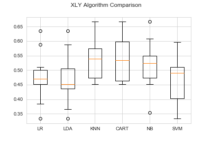  
<br/>

&nbsp;&nbsp;&nbsp;&nbsp;&nbsp;&nbsp;&nbsp;&nbsp;&nbsp;&nbsp;&nbsp;&nbsp;&nbsp;&nbsp;&nbsp;&nbsp;&nbsp;&nbsp;&nbsp;&nbsp;    

<br/>


| Performance                              |                             |
|:---:                                     | :---:                       |
|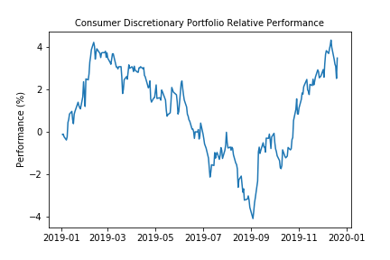 |   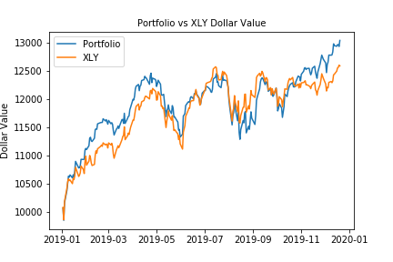 |


<br/>

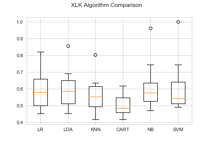

<br/>

&nbsp;&nbsp;&nbsp;&nbsp;&nbsp;&nbsp;&nbsp;&nbsp;&nbsp;&nbsp;&nbsp;&nbsp;&nbsp;&nbsp;&nbsp;&nbsp;&nbsp;&nbsp;&nbsp;&nbsp;  
<br/>

| Performance                               |                             |
|:---:                                      | :---:                       |
|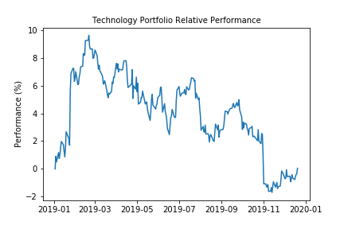| 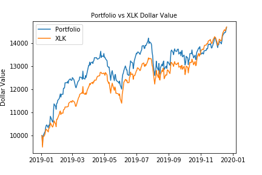 |


<br/>
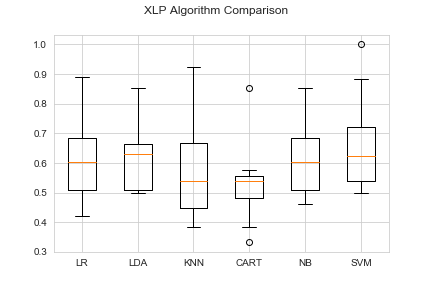
<br/>
&nbsp;&nbsp;&nbsp;&nbsp;&nbsp;&nbsp;&nbsp;&nbsp;&nbsp;&nbsp;&nbsp;&nbsp;&nbsp;&nbsp;&nbsp;&nbsp;&nbsp;&nbsp;&nbsp;&nbsp;  
<br/>

| Performance                               |                             |
|:---:                                      | :---:                       |
|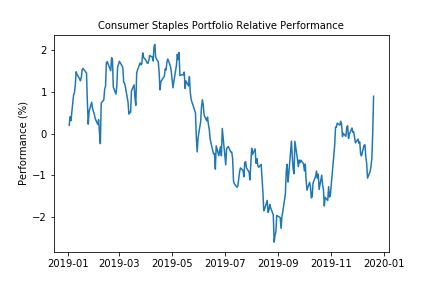  | 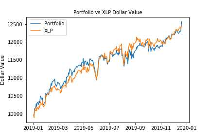| 

<br/>
<br/>
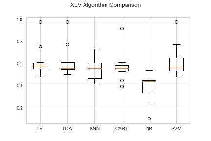 
<br/>
<br/>
&nbsp;&nbsp;&nbsp;&nbsp;&nbsp;&nbsp;&nbsp;&nbsp;&nbsp;&nbsp;&nbsp;&nbsp;&nbsp;&nbsp;&nbsp;&nbsp;&nbsp;&nbsp;&nbsp;&nbsp;  
<br/>
 <br/>
 
| Performance                               |                             |
|:---:                                      | :---:                       |
|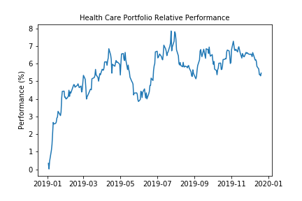  | 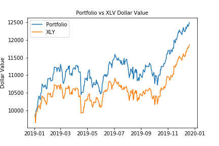 |
